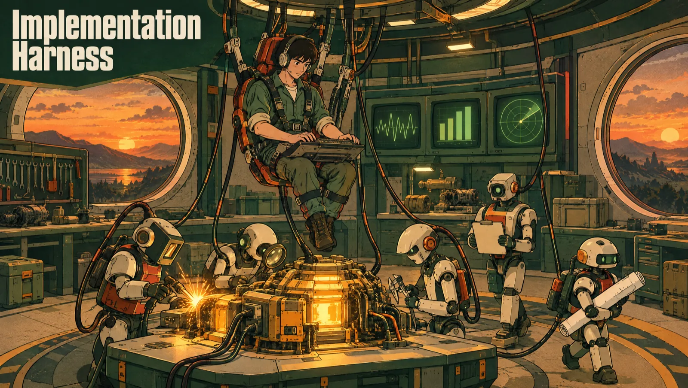

Implementation Factory is a local software factory built on Claude Code: tickets go in, merge requests come out. You paste the URL of a GitLab ticket or a GitHub issue, the factory finds the matching checkout, creates a git worktree for the run, opens a Claude Code terminal in it and shows the progress, the agents, the tools and the deliverables. You can also paste several tickets at once: the factory queues them and holds back the ones that would touch the same code. You stay at the gates: it asks its questions before it plans, and the merge request waits for your review.

The repository contains a Claude Code plugin whose `/implementation-factory:implement` command orchestrates the work: reading the ticket, clarification questions, planning, implementation, tests, specialised reviews and preparing the merge request. The console is what runs that command and makes it visible. It uses the Claude Code login already present on the machine and makes no direct call to the Anthropic API.

The interface opens in the browser with the `impl` command, which serves the compiled version of the checkout. There is no desktop application. The factory runs from its own repository, so the self-improvement loop can modify the code that is running.

The console's interface is in English. Labels and messages are quoted here as they appear on screen. The language of what the workflow writes (reports, questions, merge request text) is chosen by the `IMPL_LANGUAGE` setting (`en` by default, `fr` for French).

## How agents and skills are organised

Agents define responsibilities and deliverables. Skills hold the methods, loaded when needed. The developer's self-check and the adversarial review follow separate methods and share evidence collection. The formats the console reads stay in dedicated contracts.

Six agents carry a run:

| Agent | Role |
|---|---|
| `ticket-planner` | turns the ticket and the current code into a task plan, with assumptions, dependencies, risks and verification steps |
| `developer` | implements a task and checks its own work |
| `senior-reviewer` | independent code review, then justified fixes within the allowed scope |
| `designer-reviewer` | design review of a change visible in the interface, with or without Figma, without reading the product code |
| `qa-reviewer` | independent validation of the final behaviour, without modifying the delivered code |
| `review-orchestrator` | chains the reviews, routes the fixes and writes the review summary |

A seventh agent, `ticket-scheduler`, takes part in no run. The console calls it before a batch starts, to predict what each ticket would touch (see [Launch several tickets at once](#launch-several-tickets-at-once)).

The pilot picks a review tier from the size of the diff:

- tier 0: a single pass of `senior-reviewer`, with no orchestrator and no rework loop, while the pilot runs the general checks itself (lint, typecheck, tests), plus `designer-reviewer` when the design review is triggered;
- tier 1: `senior-reviewer`, then `designer-reviewer` if the pilot triggered the design review and the application is reachable, then `qa-reviewer`, once each;
- tier 2: `review-orchestrator` runs the full loop. `senior-reviewer` and `qa-reviewer` keep their default model there, Opus. At tiers 0 and 1, the pilot calls them with Sonnet. `designer-reviewer` runs on Sonnet at every tier.

QA writes its test plan to `qa-plan.md` before opening the author's reports, then tries to make each criterion fail. It declares a criterion met only on an observation it ran itself. When a criterion has no observation, the verdict is `INCONCLUSIVE` and the merge request is opened as a draft, with those criteria named.

The design review works without Figma. With a mockup, Figma frames or one attached to the ticket, it runs as soon as the change is visible in the interface, at every tier. With no mockup at all, the pilot triggers it only if the diff modifies a shared interface component or creates a screen or a route. It judges the change against the best reference available: the Figma frames (`figma`), the mockups attached to the ticket (`ticket-mockup`) or the screens the application already ships (`live-neighbours`). It writes its inventory to `design-inventory.md` before reading the developer's measurements. A design verdict of `INCONCLUSIVE` does not block delivery. The merge request, the review comment and the final report flag it with the words "design not verified" (design not verified), with the reason.

See [Agents, skills and independent review](docs/engineering-workflow.md) for the capabilities, the triggers, how context is passed, the review methods and the checks. The [agent map](https://greg-klein.github.io/implementation-factory/agent-map.html) shows who does what on which model, agents, scripts and the engineer's own steps, from the intake of a ticket to the self-improvement loop. The [architecture page](https://greg-klein.github.io/implementation-factory/architecture.html) shows the console underneath: the path of a hook, the questions, the run worktree, run health, the evidence chain and what stays on disk. Both pages are served by GitHub Pages from `docs/`; from a checkout, open `docs/agent-map.html` or `docs/architecture.html` in a browser (they load their diagram library from a CDN).

## One-command installation

Requirements:

- macOS or Linux;
- [Claude Code](https://docs.anthropic.com/en/docs/claude-code) installed and logged in;
- Node.js 22.12 or later;
- `git`, and the CLI of your forge installed and authenticated: [`glab`](https://gitlab.com/gitlab-org/cli) for GitLab tickets, [`gh`](https://cli.github.com) for GitHub issues. One is enough, both work side by side.

Run:

```bash
curl -fsSL https://raw.githubusercontent.com/Greg-Klein/implementation-factory/main/install-remote.sh | bash
```

The same command updates an existing installation with a `git pull --ff-only`. The installation compiles the Next.js interface, then `impl` starts that production build.

The installer downloads the dependencies and creates two commands in `~/.local/bin`:

- `impl`, the short alias;
- `implementation-factory`, the explicit name.

If `~/.local/bin` is not in `PATH` yet, the installer prints the line to add to your shell configuration.

### With an agent

Paste this prompt into a coding agent (Claude Code, Codex, opencode). It installs the factory and whatever it needs that is missing.

```text
Install Implementation Factory from https://github.com/Greg-Klein/implementation-factory on this machine (macOS or Linux).

1. Read the README of the repository to know what the factory needs.
2. Check for Node.js 22.12 or later (`node --version`). If it is missing or older, install it with the version manager already on this machine (nvm, fnm, volta), otherwise with the package manager of this system (Homebrew on macOS).
3. The console builds a native module (node-pty). Check for a C++ toolchain: the Xcode command line tools on macOS (`xcode-select -p`), `build-essential` and `python3` on Linux. Install what is missing.
4. Check for Claude Code (`claude --version`). If it is missing, install it following https://docs.anthropic.com/en/docs/claude-code. Do not log in for me: tell me to run `claude` once and log in.
5. Ask me whether my tickets are on GitLab, GitHub or both. For GitLab, check for glab (`glab --version`), install it following https://gitlab.com/gitlab-org/cli if it is missing, and run `glab auth status`. For GitHub, check for gh (`gh --version`), install it following https://cli.github.com if it is missing, and run `gh auth status`. If a CLI is not logged in, do not log in for me: tell me to run `glab auth login` or `gh auth login`.
6. Run `curl -fsSL https://raw.githubusercontent.com/Greg-Klein/implementation-factory/main/install-remote.sh | bash`.
7. Check that `impl help` answers. If the command is not found, tell me how to add `~/.local/bin` to my PATH, without editing my shell files yourself.

Do not use sudo without asking me first. Do not start the factory and do not change its configuration: finish by telling me what you installed, what was already there, and that the next steps are `impl config`, then `impl demo` to look around or `impl` to start.
```

## Console access and isolated checks

`impl start` associates the browser using a private token stored in the local data directory. The CLI reads that token for the local listener. After a restart, open the console with `impl start` again to renew the browser session. For direct `npm run dev`, enter the token from `console/data/control-token` in the connection form.

Automatic promotion requires a running Docker daemon and a locally pulled check image:

```bash
docker pull mcr.microsoft.com/playwright:v1.63.0-noble
```

`IMPL_CHECK_IMAGE` can name another trusted image with compatible Node.js, native build tools and Playwright browsers. If Docker or the image is missing, branches stay available and the console shows "Automatic merge paused". No candidate check runs on the host as a fallback. Dependencies requiring credentials or checks requiring an external service must be reviewed manually.

Listening outside loopback requires a control token of at least 32 characters and HTTPS certificate/key files (`IMPL_CONTROL_TOKEN`, `IMPL_TLS_CERT`, `IMPL_TLS_KEY`). Wildcard listeners also require `IMPL_PUBLIC_URL` naming the HTTPS origin covered by the certificate. A remote CLI supplies its token explicitly. See [SECURITY.md](SECURITY.md) for access, isolation and resource limits.

Automatic repository detection compares the server and project of a ticket with the Git remotes. Several matching checkouts require an explicit path. A watcher’s legacy project paths are resolved only on the ticket’s server, so the same project path on another forge is never selected automatically.

## Usage

```bash
impl
```

| Command | Effect |
|---|---|
| `impl` or `impl start` | starts the interface in the background, opens the browser and gives the terminal back |
| `impl demo` | starts the interface on a simulated scenario |
| `impl restart` | stops the running server, then starts the compiled version again |
| `impl stop` | stops the running server |
| `impl status` | says whether a server is listening and whether it serves the build on disk |
| `impl config` | reads and changes the local configuration |
| `impl improve` | processes the self-improvement feedback with Claude Code |
| `impl help` | prints the help |

The server keeps running once the terminal is closed. Its output goes to `console/data/server.log` (`server.log` in `IMPL_DATA_DIR` when it is set): follow it with `tail -f console/data/server.log`, and stop the server with `impl stop`. A server that exits while starting is reported with the end of that log and a non-zero exit code.

An unknown command is refused with the help and a non-zero exit code, and the server does not start silently.

`impl status` queries `/api/runs`, then asks the server for every `/_next/static/` resource the page references. A server still running on an earlier build answers with a manifest whose files the rebuild deleted, which gives an unstyled page. Its exit codes: `0` listening and consistent, `1` listening but inconsistent, `3` stopped.

```console
$ impl status
Server    : listening on http://127.0.0.1:3210 (PID 76579)
Build     : caiz9bak8t_BsOXSZHCmN on disk
API       : answers
Runs      : 2/3 slots taken, 3 shown, 1 queued
Assets    : 11 served, build up to date
```

To explore the interface with no ticket and no call to Claude Code:

```bash
impl demo
```

This command opens a simulated local scenario with progress, agents, generated documents and interactive decisions. Each step lasts five seconds. The first review asks for fixes and sends the work back to the implementation agent, then a second review approves the changes. The Evidence tab shows five criteria in every possible state, including a first-round failure replaced in the second round and kept in the history with its capture. The demo modifies no repository, does not contact GitLab and does not feed the self-improvement loop. Two other scenarios open from the address, on a server that is already running: `/?demo=incident` plays a run whose pilot hands back with nothing next, and `/?demo=batch` plays a batch of three invented tickets, two of which touch the same code. Demo mode adds no control to the normal interface: the improvement approval and the feedback field are shown as in real use, marked `demo`, and their actions stay simulated.

To restart a server that is already running:

```bash
impl restart
```

`impl` detects a factory that is already listening and only opens the browser. After the interface is rebuilt, the running server still serves the old Next.js manifest, the stylesheets return an error and the page shows without styles. `impl restart` stops the server on the current port, waits for the port to be free and starts the compiled version again. It combines with demo mode (`impl restart demo`) and stops nothing if its argument is invalid.

The browser opens on <http://127.0.0.1:3210>.

### From the terminal, without the browser

Everything the interface does is also a command of `impl`. The commands are a second client of the same server, over the socket and the routes the page uses: a run started in the browser is followed from a terminal and the other way round, and both can be open at once.

```bash
impl run https://gitlab.example.com/acme/shop/-/issues/12 -f   # starts the run and follows it
impl runs                                                       # runs, queue, kept worktrees
impl watch 12                                                   # follows the run of ticket 12
impl answer 12 2 "keep the critical alerts"                     # answers its decision
```

| Command | Effect |
|---|---|
| `impl run <ticket-url>... [-r <checkout>]... [-m <instruction>] [-f]` | starts a run; several tickets are queued as a batch and compared first; `-f` follows the run; `--demo [workflow\|incident\|batch]` plays a simulated one |
| `impl runs` | lists the runs, the queue, the kept worktrees and the watcher's tickets |
| `impl show <run>` | one run: step, agents at work, plan, decision waiting, incident |
| `impl watch [<run>]` | follows a run until its workflow ends, or every run when none is named |
| `impl attach <run>` | the terminal of the run's session, `Ctrl-]` leaves it running |
| `impl answer <run> [<answer>...]` | answers the decision a run waits on |
| `impl trust <run> accept\|refuse` | answers the folder trust dialog |
| `impl tell <run> <instruction>` | sends an instruction to the session |
| `impl abort <run>`, `impl close <run>` | stops a run and its session, removes an ended run from the list |
| `impl queue [cancel\|force\|move] ...` | shows the queue; removes a launch, starts it anyway (`--stacked`, `--onto <ticket-url>`), moves it (`--before <id>`, `--end`) |
| `impl incident <run> [continue\|stop\|dismiss]` | shows the open incident of a run, or acts on it (`--reason <text>`) |
| `impl worktree rm <run> [--force]` | removes the worktree an ended run left |
| `impl docs <run> [<document>]`, `impl evidence <run>` | the documents of a run, its acceptance criteria and what verifies each |
| `impl metrics` | what each run cost and delivered |
| `impl recipe [<checkout>]`, `impl findings [<checkout>]` | what is kept for a repository, `--forget` drops it |
| `impl proposals [dismiss\|launch] ...` | the watcher's tickets that were not queued |
| `impl improvements [diff\|report\|approve\|reject\|revert <branch>]` | the improvement branches |
| `impl repos [<ticket-url>]` | the checkouts found, and the one a ticket goes to |
| `impl feedback <run> <text>` | leaves feedback on a run for the improvement loop |

A run is named by its id, the end of its id as the lists show it, its ticket number (`#12` or `12`) or its ticket address. A name that fits several runs is refused with the list. `--json` on the reading commands prints the data the interface is fed, and `impl <command> --help` gives the arguments of one command.

`impl answer` takes one answer per question, in the order asked: the number of a suggested choice, several numbers separated by commas when the question takes several, or your own words. With nothing after the run, it asks at the terminal. `impl watch` and `impl run -f` ask the decisions the same way when a person is at the terminal, and print the command that answers them otherwise; they end `0` on a completed run and `1` on any other end.

Exit codes: `0` done, `1` refused by the console or failed, `2` a command written wrong, `3` no console answers.

`impl run` starts the server when none is listening, without opening the browser. The other commands start nothing: a server that starts also starts whatever its queue held, which a reading should not do.

### On a remote machine

The server and the sessions run on the machine that holds the checkouts, and the commands above work in a plain SSH session there: nothing needs a browser. Claude Code, `glab` or `gh` have to be signed in on that machine.

To use the interface or the commands from another machine, forward the port instead of exposing it. The console only answers to the address it listens on, so the tunnel keeps the same port on both sides:

```bash
ssh -N -L 3210:127.0.0.1:3210 user@remote     # then http://127.0.0.1:3210 in the browser
IMPL_CONSOLE_URL=http://127.0.0.1:3210 impl runs
```

`IMPL_CONSOLE_URL` names the console the commands talk to, and with it `impl run` never starts a local server. The paths given to `-r` are paths on the machine the console runs on.

## Driving runs

In the console:

1. paste the URL of the GitLab ticket or the GitHub issue, or several URLs, one per line (see [Launch several tickets at once](#launch-several-tickets-at-once));
2. check the detected project or enter its path;
3. add an instruction specific to this run if needed;
4. start the workflow, then answer the decisions in the dedicated panel or talk freely in the terminal.

### Several runs in parallel

The factory holds several runs at once. The left column lists them, newest first, and the selected run shows on the right. Each row gives the repository and the ticket, the step reached, what the agent is doing right now, and an orange badge when a decision is waiting for an answer. The **+** button at the top of the list goes back to the launch form without interrupting the runs in progress.

Several tickets of the same repository can run at the same time, because each run works in its own worktree (see [One worktree per run](#one-worktree-per-run)). Two limits bound the parallelism, and batch scheduling adds a third, described below:

- **one run per ticket of a repository.** Two sessions on the same ticket would fight over its branch and its merge request;
- **`IMPL_MAX_CONCURRENT_RUNS` sessions in total** (3 by default). Each one is a real Claude Code session, with its own quota and CPU.

A launch that hits either limit goes to the queue, shown under the list with the reason it waits, "ticket already running" or "every slot is taken". It starts on its own as soon as the ticket or a slot is free. The queue is saved in `queue.json`, under the [data directory](#configuration), with the schedule that holds it, and survives a restart. The requests that were only waiting for a slot start as soon as the server listens again, without anyone launching them again. The ones waiting for a merge request keep waiting for it. A cross removes a request from the queue.

A run frees its slot as soon as its workflow is finished, even while its session stays open at its prompt: only working runs count against `IMPL_MAX_CONCURRENT_RUNS`. The open session still holds its ticket. The **Close the session** button closes it, and when a queued launch is waiting for that ticket, the factory closes it itself. Once the session is closed, the bin icon on its row, or the **Close** button of the view, removes the run from the list. Its documents, its conversation and its log stay archived in `runs/<id>/`, under the data directory.

The notifications, the tab title and the tab icon cover every run at once, because the run that needs an answer is rarely the one you are looking at. Messages that concern no run in particular (a request put in the queue, an improvement rebased) show in a banner under the header.

The **Tracking** tab shows the tasks of the plan (`planner-output.json`) in three columns, To Do, In Progress and Done. A task moves to in progress when the orchestrator gives it to a `developer` agent, and to done when its report `developer-report-<id>.md` is written. Each agent of a run gets a first name and a photo, in the order it starts, and the card shows the agent that holds the task, as "Tom · Dev". The same name appears in the agents panel.

The **Generated documents** button opens a built-in reader for the ticket context, the plans, the test reports, the reviews and the MR descriptions kept during the run.

The reader does not interrupt the run. If Claude Code asks a question while you are reading, a banner flags the pending decision and the **Answer** button closes the reader to show the clarification card.

The progress panel sums up the deliverable of the run: the ticket, the working branch as soon as the workflow creates it, and the merge request as soon as it is opened. The ticket and the merge request are clickable, the branch is there to be read back. The merge request is read from the output of the command that opens it, so it appears without the workflow having to declare it.

A run takes a long time and does not need watching. The tab title and its icon follow the state of the runs, and the browser sends a system notification when a decision is waiting for an answer, when the session needs attention and when the run ends. The browser permission is asked on the first launch, and a notification is sent only if the page is not in the foreground.

The speaker button in the header adds a sound to the same three moments: a two-note rise when something is expected from you, a three-note resolution when the run is over. It is **off by default** and the setting is remembered in the browser. Turning it on plays the sound at once, to check the setting without waiting for a run.

The interface plays the sound at the moment the question becomes blocking. A sound requested from the model arrived early and could be forgotten. Two caveats: a browser forbids a page to play sound before an interaction, so the very first signal of a session opened without a click stays silent, and two tabs open on the factory sound twice.

The factory runs Claude Code in the worktree of the run with the plugin of this repository. No plugin file is copied to `~/.claude`.

### Launch several tickets at once

The **Ticket** field accepts several URLs, one per line, GitLab and GitHub mixed. URLs separated by spaces, commas or semicolons on one line are read too. Under the field, the form gives the number of tickets recognised, the duplicates ignored and the lines that are not a ticket URL. While a line is invalid, the batch does not start.

From two tickets on, the directory field disappears: the repository of each ticket is detected from its URL, in the roots of `IMPL_SEARCH_ROOTS`. The specific instruction applies to every ticket of the batch. The button becomes **Start N tickets**.

The batch is accepted or refused as a whole. If a single ticket has no checkout, nothing is queued and the banner says which one. A ticket the factory already has, queued, running or behind a merge request it watches, is left out, and the banner gives the count.

#### Batch analysis

Before starting, the factory compares the tickets of one repository. To do so it opens a Claude Code session with no terminal (`claude -p`, Sonnet model) in the main checkout, on the `/implementation-factory:schedule` command. The `ticket-scheduler` agent reads each ticket with `glab` or `gh`, looks in the repository for the files the ticket would touch and links the tickets that cannot run together: those that would modify the same files, and those where one needs the result of the other. This session modifies nothing in the repository.

- There is one session per repository and per batch. It does not count against `IMPL_MAX_CONCURRENT_RUNS`.
- A ticket alone in its repository, with no other known ticket to compare with, starts without analysis.
- A ticket added later is compared with the predictions already made for the tickets queued, running or waiting for their merge. Those are not computed again.
- Two tickets of different repositories never hold each other.
- The analysis has `IMPL_SCHEDULE_TIMEOUT_MINUTES` minutes (5 by default). If it fails, runs past that time or returns an invalid file, the tickets concerned run one at a time on their repository and the queue shows "Analysis failed". A restart of the console during the analysis has the same effect. The next analysis of the same repository takes these tickets again with the new ones, as long as they are queued, running or waiting for their merge. No analysis is started for them alone.
- A ticket too vague to predict is marked "Unreliable prediction" and runs alone on its repository.

#### What the queue shows

The queue shows under the runs in progress, by batch ("Batch of 14:32 · 3 tickets queued"), then by repository. Each row says what the ticket is waiting for:

| Row | What the ticket is waiting for |
|---|---|
| "Analysis in progress" | the answer of the analysis session, or the blocking links of the ticket being read from the forge |
| "Waiting, conflict with #217 running" | #217 is running and touches the same code |
| "Waits for MR !12 to be merged (#217)" | the run of #217 is over, its merge request is not merged yet |
| "State of MR !12 unknown (#217)" | The forge does not answer; the ticket stays held until the state is known. A GitHub ticket reads "PR #12" |
| "Depends on #217, still queued" | #217 has to go first, and has not started |
| "Runs after #217" | the two tickets conflict, #217 is ahead in the queue |
| "Waiting, ticket already running" | a run already holds this ticket |
| "Waiting, every slot is taken" | a slot |

A ticket held by the schedule takes no slot, and the tickets behind it that conflict with nothing go ahead. The **Why it waits** disclosure gives the reason the agent wrote and the summary of the ticket. A "blocks" or "blocked by" link of the forge between two tickets of the queue orders them whatever the agent said, and reads "GitLab marks #218 as blocked by #217." Dragging a ticket, or its arrows, changes the order of the tickets of one repository; lone launches are dragged among themselves. The cross removes a ticket from the queue. A ticket another one depends on stays ahead of it, whatever order is chosen.

A ticket in conflict waits for the other ticket's merge request to be merged, not only for its run to end: it then starts from the updated base. If that merge request is closed without being merged, or if the run ends without opening one, the ticket is released and the banner says so.

#### Start anyway

The disclosure offers two forced starts. A forced ticket still waits for a free slot, and does not start while a run holds the same ticket.

- **Start from the base**. The ticket starts from the base branch without waiting for the other one. Both tickets touch the same code, so the second merge request will probably have to be reworked by hand. Also offered during the analysis: nothing says yet whether the ticket conflicts.
- **Stack on `<branch>`**. The ticket starts from the other ticket's branch, and its merge request targets that branch. It can only be merged after the other one. When the other one is merged and its branch deleted, GitLab retargets the second. GitHub does too, but only when it deletes the branch itself ("Delete branch" on the merged pull request, or the repository setting that deletes head branches): a branch deleted with `gh pr merge --delete-branch` or `git push --delete` closes the stacked pull request instead. Offered only when the other ticket's branch already exists.

#### What it costs

- **The analysis** is a Claude Code session on Sonnet, per repository and per batch. It uses the quota of the logged-in account, as a run does, and the analysis timeout bounds it.
- **Watching the merge requests uses no tokens.** The Node server calls `glab api`, or `gh api` for a pull request, to read its state, without opening a Claude session. The call happens every 60 seconds, only for the merge requests a queued ticket is waiting for. When nothing waits any more, the server stops asking the forge. `IMPL_MERGE_POLL_MS`, set in the launch environment, changes this interval.

#### Limits

- The scheduling ran once on a real GitLab project: three tickets of a small test repository, with the real Claude Code. The analysis took about 30 seconds, the tickets held behind a merge request were released within seconds of the merge, and the ticket started after it contained the merged code. One trial does not measure the quality of the predictions. Never tried for real: the stacked start, the forced start from the base, and a conflict found between two tickets that were both analysed without failure. The automated tests replace `claude` and `glab` with stand-ins.
- A prediction is an estimate made before the code is written. Two tickets judged independent can still conflict at merge time.
- The factory does not pull tickets from GitLab by label or assignee itself: you paste the URLs, or an outside watcher finds them (next section).

### Tickets found by a watcher

The factory can show tickets found by an outside tool, for example a script that asks GitLab for a label, an assignee and a status. That tool writes the list of tickets it found to `console/data/ticket-proposals.json`, and the factory reads the file again every five seconds. The two share nothing else: either can be stopped without affecting the other, and without the file the factory works as before.

Every new ticket of the file is queued as soon as the factory reads it, without a click. The tickets read together form one batch, so the tickets of one repository are compared before they start, and the queue holds them like pasted URLs: the slots of `IMPL_MAX_CONCURRENT_RUNS`, the conflicts and the merges still decide when each one runs. Each run costs tokens, so the watcher's filter is what decides how much the factory spends.

The watcher can name the branch a ticket starts from with `baseBranch`, typically the feature branch of its epic. The run then cuts its branch from it and its merge request targets it, without asking. Without it, the run asks for the base when there is more than one candidate.

A ticket the factory cannot launch, for example because it has no checkout under `IMPL_SEARCH_ROOTS`, stays in the left list under **From the watcher** with the reason. It is not tried again until it leaves the file or the console restarts. **Dismiss** removes it from the list.

A ticket queued or dismissed is not queued again while it stays in the file. If it leaves the file and comes back, it is queued again. A ticket already queued, running or waiting for its merge is left alone. A ticket cancelled in the queue is not queued again while it stays in the file.

The `IMPL_TICKET_PROPOSALS_FILE` setting names another file by its absolute path. The expected format is described in [contracts/ticket-proposals.md](contracts/ticket-proposals.md).

### One worktree per run

Before opening the session, the factory creates a git worktree of the project in `<project>/.claude/worktrees/<run id>`, detached at the current commit of the main checkout. Claude Code starts in that directory and does all its work there: the ticket's branch, the commits, the `.claude/tasks` directory and the development server. The main checkout is not touched. Its branch, its uncommitted changes and its stash stay as they are, and you can keep working in it during the run.

What the worktree takes from the main checkout:

- the dependency directories Git ignores, at any depth (`node_modules` by default, setting `IMPL_WORKTREE_DEPENDENCY_DIRS`). They are copied, copy-on-write when the filesystem allows it: the copy then takes no disk space until one side changes, and an install in the worktree stays there. If the copy fails, the directory is linked with a symbolic link;
- the `.env*` files Git ignores and the `.claude/settings.local.json` file (setting `IMPL_WORKTREE_COPY_FILES`), copied;
- when the repository sets `core.hooksPath` to a directory inside it, what Git ignores there, copied. That is the `.husky/_` helper husky writes at install, without which the first commit of the run fails in its hook.

The `.claude/worktrees/` directory and the links are written to the repository's `.git/info/exclude`. They do not show in `git status` and enter no commit, and the tracked `.gitignore` is not modified. Build outputs (`.next`, `dist`) are not provided, so the first build of a run is a full one. When a ticket changes the dependencies and `node_modules` is a link, the workflow first replaces it with a real install in the worktree, so it modifies neither the main checkout nor the other runs.

If the worktree cannot be created, the run does not start: the factory never falls back on the main checkout. If the dependencies cannot be brought over, the run starts and the activity feed says so.

Two runs of the same project may want the same port for their development server. The workflow starts its own on a free port.

Once the session is closed, the factory removes the worktree itself when all these conditions hold:

- the run is over and the workflow is not blocked;
- the merge request exists and is not a draft;
- the evidence archive has been confirmed;
- the tree is clean;
- the last commit is on a branch of the remote, according to the local references.

The ticket's branch is never deleted, and the merge request stays.

In every other case the worktree is kept, so the work can be resumed, and the activity feed gives the reason, for example "no merge request" or "unpushed changes". As soon as its session is closed, the run view offers the **Remove the worktree** button. If the worktree holds uncommitted or unpushed work, the factory says what would be lost and asks for confirmation. What is not committed is then lost, the branch and its commits stay in the repository.

A run removed from the list with **Close**, or left by a stop of the console, stays reachable while its worktree is on disk: it appears in the **Kept worktrees** group of the left column, or under **Interrupted** if it also carries an open incident. On start, the factory applies the same rules to the worktrees of earlier runs: it removes the ones that meet the conditions, forgets the ones whose directory is gone and keeps the others with their reason.

Launched without the console, the plugin works as before, directly in the checkout.

When Claude Code uses `AskUserQuestion`, the factory shows the decisions in a dedicated panel: the suggested choices can fill in the answer, which stays editable in a text field before it is sent. The answer goes back to Claude Code through the waiting hook. The built-in terminal stays visible and interactive during the whole run, for free exchanges and for the commands that do not go through this panel.

## Configuration

The repository's configuration is set with:

```bash
impl config
```

The assistant goes through each setting, shows the current value between brackets, keeps that value if you press Enter, refuses an invalid entry and offers to restart the server when a change requires it. It writes a local `.env`, ignored by Git.

For quick or scripted use:

| Command | Effect |
|---|---|
| `impl config list` | effective value of each setting and where it comes from |
| `impl config get KEY` | a single value, on standard output |
| `impl config set KEY=VALUE` | writes a setting without going through the assistant |
| `impl config path` | path of the `.env` |
| `impl config edit` | opens the `.env` in `$EDITOR`, then checks it |
| `impl config check` | checks the configuration, exits with 1 if it is broken |

The available settings:

| Variable | Effect | Default |
|---|---|---|
| `IMPL_SEARCH_ROOTS` | roots where checkouts are looked for, separated by commas | `~/workspace` |
| `IMPL_PERMISSION_MODE` | permission mode of each run: `manual`, `acceptEdits`, `auto`, `dontAsk`, `bypassPermissions` | `auto` |
| `IMPL_LANGUAGE` | language of what a run writes for people (questions, reports, merge request or pull request text): `en` or `fr`. The interface itself is always in English | `en` |
| `IMPL_SELF_IMPROVEMENT_AUTORUN` | self-improvement session at the end of a run that proved something went wrong, and automatic merge of its branch (see [Automatic merge](#automatic-merge)); `false` turns the whole loop off | `true` |
| `IMPL_REMOTE_CONTROL` | Remote Control on the terminal of a run | `true` |
| `IMPL_PORT` | listening port | `3210` |
| `IMPL_HOST` | listening interface; outside the loopback, the console is reachable from the network and says so on start | `127.0.0.1` |
| `IMPL_NO_OPEN` | `1` to start without opening the browser | `0` |
| `IMPL_MAX_CONCURRENT_RUNS` | number of runs held in parallel, from 1 to 10; beyond it, launches wait in the queue | `3` |
| `IMPL_SCHEDULE_TIMEOUT_MINUTES` | minutes given to the analysis of a batch of tickets, per repository, from 1 to 60; past it, the tickets of that repository run one at a time | `5` |
| `IMPL_TICKET_PROPOSALS_FILE` | absolute path of the file an outside watcher writes the tickets to propose in; empty for `ticket-proposals.json` in the data directory | empty |
| `IMPL_WORKTREE_DEPENDENCY_DIRS` | names of the dependency directories Git ignores that the worktree of a run takes from the main checkout, at any depth, separated by commas; no build outputs | `node_modules` |
| `IMPL_WORKTREE_COPY_FILES` | files copied from the main checkout to the worktree of a run, separated by commas: a name pattern such as `.env*` for files Git ignores, or a path from the root of the repository | `.env*,.claude/settings.local.json` |
| `IMPL_STALL_MINUTES` | minutes without progress before the console raises a doubt about a run in progress (a doubt only: nothing is stopped or restarted) | `10` |
| `IMPL_GITLAB_STATUS_STARTED` | name of the GitLab status a run gives its ticket when it creates the branch; status names depend on the GitLab group, and nothing is moved on GitHub | `In progress` |
| `IMPL_GITLAB_STATUS_MERGE_REQUEST` | name of the GitLab status a run gives its ticket once the merge request is open | `In progress - Merge request` |
| `IMPL_DEMO_STEP_MS` | duration of a step in demo mode | `5000` |

Three more variables are read only by the `gitlab-tickets` skill, which holds ticket-writing conventions, and are not offered by `impl config`: `IMPL_GITLAB_TICKET_PROJECT` (path of the project tickets are created in), `IMPL_GITLAB_EPIC_GROUP` (path of the group the epics live in) and `IMPL_GITLAB_ASSIGNEE` (username the tickets are assigned to). Write them in the `.env` by hand when you use that skill.

A variable set in the shell wins over the `.env`, which wins over the default. A one-off setting therefore needs no write:

```bash
IMPL_PORT=4321 impl
IMPL_NO_OPEN=1 impl
```

A few variables are read from the environment only and are not in `impl config`. They are for tests and unusual setups:

| Variable | Role | Default |
|---|---|---|
| `IMPL_HEALTH_TICK_MS` | how often the health of each run is evaluated | `15000` |
| `IMPL_HEALTH_TURN_GRACE_MS` | time a pilot may sit idle after a turn before the run is reported with no next action | `60000` |
| `IMPL_HEALTH_ARTIFACT_GRACE_MS` | time an agent's expected file has to arrive after the agent ends | `30000` |
| `IMPL_SCHEDULE_TIMEOUT_MS` | the batch analysis time limit in milliseconds; wins over `IMPL_SCHEDULE_TIMEOUT_MINUTES` | unset |
| `IMPL_MERGE_POLL_MS` | how often a watched merge request is checked | `60000` |
| `IMPL_PROPOSALS_POLL_MS` | how often the watcher's file is read | `5000` |
| `IMPL_GATE_STEP_TIMEOUT_MS` | time one check of the stop gate may take | `600000` |
| `IMPL_GATE_BUDGET_MS` | time all the checks of one stop may take together | `1200000` |
| `IMPL_STOP_GATE` | `off` disables the stop gate | on |
| `IMPL_HOOK_TOKEN` | fixes the secret the hooks present, which is otherwise drawn at each start; meant for the test suite | drawn |

The installers read three more: `IMPL_BIN_DIR` (where `install.sh` links `impl`, `~/.local/bin` by default), and for `install-remote.sh`, `IMPL_INSTALL_DIR` (where the checkout goes, `~/.local/share/implementation-factory`) and `IMPL_REPOSITORY` (the repository to clone).

The runs, the queue and the feedback are kept in `console/data/`. `IMPL_ENV_FILE` and `IMPL_DATA_DIR`, set in the launch environment, choose other absolute paths, and `IMPL_PLUGIN_ROOT` names a checkout of the factory other than the one serving the console.

### Session permissions

A run has to reach its end unattended. It therefore starts with an explicit permission mode instead of the one configured on the machine that opens it. The default is `auto`, the same as the background sessions of the factory. `manual` hands control back before each tool, at the cost of a run that stops at the first question. `bypassPermissions` checks nothing any more. The `plan` mode is not offered, because it answers with a plan and never opens a merge request.

### Terminal reachable remotely

A run starts with Remote Control on. The session shows its `claude.ai/code/session_…` link from the first second, and the terminal can be picked up from a phone or another machine without waiting for the factory to offer anything. The session stays tied to the account already authenticated in Claude Code and is not exposed to a third party. `IMPL_REMOTE_CONTROL=false` starts it without. The self-improvement session is never concerned, because it runs in the background and is not interactive.

### Project detection

The factory walks the search roots two levels deep, reads the `.git/config` of each directory and derives the GitLab project or the GitHub repository from it. After a ticket is pasted, the detected path fills the project field if it is empty. The field stays editable and suggests the checkouts found while you type. For a repository located elsewhere, add its parent directory to `IMPL_SEARCH_ROOTS`.

## Self-improvement loop

At the end of a run, the right panel lets you record concrete feedback. It is kept locally with the run's identifier and its generated documents, then processed with:

```bash
impl improve
```

This command starts Claude Code on `/implementation-factory:improve`. It groups the pending feedback, checks the evidence of the run, creates a `self-improvement-*` branch, applies the smallest lasting improvement, runs the checks and creates a local commit. It pushes nothing and merges nothing, so the result stays inspectable and reversible.

Its worktree is cut from the last pushed commit, and the loop never pushes. The iteration therefore begins by bringing its own branch up to the factory, with `--ff-only`, so it does not diagnose a tree that lacks the improvements already accepted. A branch that already carries a commit makes the command refuse and does not move.

Before choosing what to fix, it also reads the `self-improvement-*` branches the user has not yet accepted or dismissed, and the worktrees in progress. When a pending branch already contains a fix, it does not implement it again and names that branch in its report. Since several iterations can run in parallel, its diagnosis and its report carry the name of its own branch, `improvement-plan-<slug>.md` and `improvement-report-<slug>.md`, so no iteration overwrites the work of another.

The tickets, logs and raw feedback stay under `console/data/` and are never added to the improvement commit.

The factory can also criticise itself without human feedback. At the end of each workflow, including after a failure or a manual stop, it records a self-audit covering the failures, interventions, review loops, missing documents and incomplete checks. The decision is taken once per run, and only if the run left something to analyse: a delegated agent, a document produced or an unexpected exit. A session stopped before that is dismissed, with a line in the activity feed.

Recording an audit does not open an improvement session. In autonomous mode, Claude Code processes the evidence in an isolated worktree only when the factory observed something that went wrong in the run:

- the run failed, or an incident was raised;
- an acceptance criterion ended failed or blocked, or QA declared a pass over a criterion it did not observe;
- the workflow ended blocked;
- a change was asked after the final report;
- a cost stands out against the delivered runs (tokens, active time, pilot calls), which needs at least three comparable runs.

A rework round asked by a reviewer is not one of them: it is the review doing its work. A session also opens when user feedback is waiting, or when the audit of an earlier run is still waiting with one of these reasons because an improvement was undecided at the time. Otherwise the activity feed says "Self-improvement not needed", and the audit stays in `pending/` as comparison material for the next session. The reasons are written in the audit (`reasons`), and the session changes nothing on the ground of an audit that carries none.

The policy is set with `impl config`, or directly:

```bash
impl config set IMPL_SELF_IMPROVEMENT_AUTORUN=false
```

It starts the analysis in the background at the end of such a run. The option is on by default; setting it to `false` turns the loop off.

The agent works in an isolated worktree and always leaves its commit on its `self-improvement-*` branch. Nothing is pushed to GitHub. The console decides on its own whether the branch is merged (see [Automatic merge](#automatic-merge)); there is no review step. A refused branch is discarded and its feedback tried again. A merge lands in the checkout that serves the console. Each new session reads the commands, agents, skills and hooks again, so they apply from the next run, with no restart. When the merge touches `console/` or `bin/`, the console rebuilds and restarts itself as soon as no run is working.

**One improvement is in progress at a time.** While a `self-improvement-*` worktree exists, the end of a run does not open a second one. The automatic merge settles each branch within minutes of its report. The activity feed names the one that blocks and the self-audit stays in `pending/`, where the next iteration will read it. The factory destroys nothing to free the slot: the automatic merge frees it once the branch is merged or rejected. The rule comes from a measurement: the loop opened eleven branches in one day, four of them in conflict with each other, and none was promoted. They were all reworked by hand. A branch nobody has decided on is also the one the next branch diagnoses itself against.

A branch is decided only once its agent wrote its report and an improvement commit is on it. The launcher returns as soon as the work detaches, so its exit code only tells about the start. For its part, `/implementation-factory:improve` leaves its branch uncommitted when its own validation fails, a state that is never merged: the automatic merge rejects it and keeps its change as a patch beside the report.

### Automatic merge

The console checks every minute for improvement branches whose agent is done (its report is written) and whose worktree is clean. A branch with no commit is removed, its report stays beside the feedback. A branch with commits goes through three locks, in this order, and is merged only when all three agree:

1. **Mechanical rules** (`console/server/auto-merge-policy.ts`). The branch is replayed on the factory by git alone, and is rejected when it touches a protected file (the guard and the stop gate, `/improve`, `/rebase`, the judge, the reviewers and their contracts, the loop's own code, the launcher, the plugin manifest, the CI), deletes or skips a test, or exceeds 15 files or 400 changed lines.
2. **Checks rerun by the console** in a disposable Docker container containing an export of the exact candidate commit: typecheck, unit tests and build, plus the integration suite when the branch touches `console/` or `bin/`. No host directory or credential is mounted or forwarded. Installation uses the network with lifecycle scripts disabled; dependency scripts and all checks then run offline. What the improvement session says it ran is not taken on trust. Docker and the trusted check image must be available locally; otherwise promotion pauses and the branch is kept.
3. **An independent judge**, a headless Opus session on `/implementation-factory:judge-improvement` (`contracts/improvement-verdict.md`). It reads the run evidence first and writes what a correct fix should change, then reads the plan, the report and the diff. It refuses a branch whose cause is not established, that treats a symptom, overfits one run, weakens a quality gate, goes beyond its plan or leaves `docs/`, `README.md` or `CLAUDE.md` stale. It can read but writes only its verdict file: the guard refuses it any command, agent or edit. It runs from its own directory and loads the checkout's plugin, so the branch cannot change the prompt or the settings that judge it.

When the factory moved during the checks, nothing is decided and the next tick starts again. A rejected branch is discarded, never handed to you: a change left uncommitted is kept as `improvement-uncommitted-<slug>.patch` beside the report, and the feedback the branch was built on goes back to `pending/` with the reasons, so the next iteration tries another way. After two rejected attempts, that feedback is not tried again. A merged one is shown for a day as "Improvements merged automatically", with its report and a "Revert" button that adds a revert commit. Every decision is a line of `<data dir>/self-improvement-decisions.jsonl`, with the duration and the tokens of each judge session on the branch. A rejection shows no notice, and the other notices of the loop close on their own after five seconds; the **Metrics** panel counts the branches merged and rejected and lists what the judge took on each one. Nothing is ever pushed.

### Automatic rebase

The improvement branches all start from the same base and are merged one after the other. The first promotion leaves all the following ones behind the factory, and the gap grows with each merge. The factory therefore replays the pending branches onto its own `HEAD` every time it moves, that is when the console starts and after each merge. A branch one commit behind almost always replays on its own; the same branch ten commits behind never does.

The factory leaves three states untouched: a branch with no commit, because an agent may still be writing there, a branch already contained in the factory, which has nothing left to replay, and a worktree with uncommitted changes, which holds the diagnosis left by a failed validation and which a rebase would take away.

When git stops on a conflict, the factory aborts the rebase and the branch stays where it was. In autonomous mode (`IMPL_SELF_IMPROVEMENT_AUTORUN=true`), the factory then hands the rebase to a background agent started in the worktree of the branch, on `/implementation-factory:rebase`. That agent replays, resolves by keeping both intentions instead of one side, runs the checks again and merges nothing: the automatic merge then decides the replayed branch. Outside autonomous mode, the panel flags the conflict, to be handled by hand.

The factory announces the merge only if it moved its branch. Git answers "Already up to date" with a zero exit code, and a conflict leaves the repository half merged. In that second case, the factory aborts the merge and keeps the worktree. When git brings nothing, the factory tells apart two situations the exit code does not distinguish:

- **the commits of the branch are already contained in the factory**, because the work was redone by hand. The worktree is no longer of use. The factory removes it with its branch and logs "Improvements already present". Refusing this case left no exact way out, since "Merge" said nothing had been merged and "Dismiss" recorded as dismissed work that had in fact been kept;
- **the branch carries no commit**, and the agent may still be writing. The worktree is kept. The cleanup happens only if the worktree also has nothing uncommitted, because the diagnosis a failed validation leaves there exists nowhere else.

## How it works

Claude Code remains the engine of the workflow. The factory adds:

- a run registry (`console/server/registry.ts`) that starts, queues and releases the sessions, each isolated in its `RunSession` with its state, its terminal, its file watchers and its pending question;
- batch scheduling: an analysis session per repository predicts what each ticket would touch, the server holds back the tickets in conflict and reads the state of the awaited merge requests and pull requests with `glab` and `gh`, with no Claude session (see `console/README.md`);
- an interactive pseudo-terminal per run, connected to the interface over WebSocket. Each page subscribes to the run it shows and receives only its terminal and its state, while the list of runs is sent to every page;
- Claude Code hooks to follow the agents and the tools, then show and resolve the structured questions in the interface;
- an evidence record per acceptance criterion: the pilot writes a register of identified criteria, each piece of evidence cites them with the version of the code it checked, and the server computes for each criterion whether it is verified, failed, blocked or unverified, in the Evidence tab as in the merge request summary. A QA break attempt that finds no defect is shown under its criterion without counting as a verification. The server flags a QA verdict of `PASS` or `PASS_WITH_WARNINGS` written while a criterion has no QA observation on the current code (see `console/README.md`);
- detection of runs with no next action: the server tells who can move a run forward (the user, an agent, a background task, nobody), opens an explicit incident when the pilot handed back with nothing next or when the session was lost, and offers only the actions that are possible, including a request to continue sent to the session still active (see `console/README.md`);
- a watch on `.claude/tasks/` to follow the steps and keep the reports before they are cleaned up. That directory belongs to the target repository and an interrupted run had no time to clean it: only the files written since the run started are attached to it, those left by an earlier run are ignored and do not move the step rail. The watch is set on `.claude/` and restricted to `tasks/`, because the workflow deletes and recreates that directory during a run, and a watch set on it would not wake up afterwards.

### The engine layer

Everything specific to Claude Code, the executable, the hook vocabulary, the transcript format, how an instruction is submitted, lives in `console/server/engine/`. The rest of the server reasons in runs, phases, agents and documents, without knowing which agent runs underneath.

There is a single implementation today, `claude-code`, and that is deliberate. The boundary exists so that a second implementation means writing one file, without rewriting the server. The most specific mechanism of the factory, the question that blocks the agent until the user answers, was proven portable before this layer was written.

`console/server/engine/README.md` documents the contract member by member, the full path of a blocking question, and what stays coupled outside the server.

The queue and its schedule are in `queue.json`. The files of a batch analysis are not in that directory while it sits inside the plugin, because Claude Code refuses a session any write in the directory of the plugin it loaded: they go to `implementation-factory-<user>/schedule/<id>/`, under the system's temporary directory, private to your user. With a data directory outside the plugin (`IMPL_DATA_DIR`), they stay in `schedule/<id>/`. They are deleted once the answer is read, kept after a failure for the diagnosis, and wiped on the next start.

The data of a run is archived in `runs/<run-id>/`, under the [data directory](#configuration) (`console/data/` from the repository):

- `run.json` holds the state, the agents and the activity;
- `terminal.log` holds the raw output of the terminal;
- `artifacts/` holds the documents generated during the run: plans, QA reports, reviews and captures;
- `evidence/` and `acceptance/` keep each version of the evidence, their captures and the coverage summary.

This directory is local and ignored by Git. It can contain confidential information from the tickets processed and must not be shared.

A run the server could not close itself (a hard stop, a restart) is reclassified `failed` on the next start, and does not stay marked `running`. See `console/README.md`.

## Tests

From the `console/` directory:

```bash
npm run test:unit
npm run test:integration
```

The unit tests use Jest. They are split by responsibility in `tests/unit/` and follow the convention `describe(...)` then `it("should ...")`.

The integration tests are split by journey in `tests/integration/`. They use Playwright, with Google Chrome on a workstation and the Chromium it bundles in CI, and start an isolated server on port `3211`. To watch them run:

```bash
npm run test:integration:headed
```

GitHub Actions runs the TypeScript check, the unit tests, the production build and the integration tests on each pull request and each push to `main`.

## Development

```bash
cd console
npm install
npm run dev
```

Frontend changes are reloaded. A change to the server needs `npm run dev` started again, and an `impl` already running has to be restarted with `impl restart` to serve the new build.

Checks:

```bash
npm run typecheck
npm run build
```

The frontend uses Next.js, React, TypeScript, Tailwind CSS and xterm.js. The local server uses `node-pty`, WebSocket and the Claude Code hooks.

## Repository contents

```text
agents/       Claude Code subagents
commands/     the commands /implementation-factory:implement, /implementation-factory:review, /implementation-factory:improve, /implementation-factory:rebase and /implementation-factory:schedule
hooks/        events sent to the local factory, the guard that refuses a few tool calls during a run, and the stop gate that checks an agent's edits when it hands back
bin/          the impl launcher and the impl config command
console/      Next.js interface and PTY server
console/cli/  the commands that drive the console from a terminal
console/server/engine/  the layer that isolates the driven agent, one implementation: claude-code
contracts/    output formats of the agents and evidence rules
principles/   decision rules common to the agents
skills/       methods loaded when needed
docs/         how agents, skills and review are organised, agent map (agent-map.html), console architecture (architecture.html)
install.sh    installation and creation of the global commands
install-remote.sh  clone or update from the curl command
```

`/implementation-factory:implement` uses two MCP servers. Playwright is used by the developer to measure its work in the browser, then by the design review and QA. Figma is used only if the ticket provides frames. Without Figma, the design review compares the change with the mockups attached to the ticket or with the screens already shipped. A missing MCP reduces the corresponding checks but does not prevent the factory from starting.

A typical run opens several browser sessions: the developer agent measures its own work, then the design review and QA go over it again. Declaring the Playwright MCP server with `--headless` keeps a Chrome window from taking the foreground each time. It also rules out a measurement error: in windowed mode, the browser silently clips a requested viewport wider than the screen, and the measurement is reported against the requested width instead of the width obtained.

```json
"playwright": { "type": "stdio", "command": "npx",
                "args": ["@playwright/mcp@latest", "--headless"] }
```

The only case that needs the opposite is a journey where the user has to act in the browser, typically a login done by hand. Removing `--headless` brings the window back.

## License

Implementation Factory is distributed under the [MIT license](LICENSE). Copyright © 2026 Gregory Klein.
