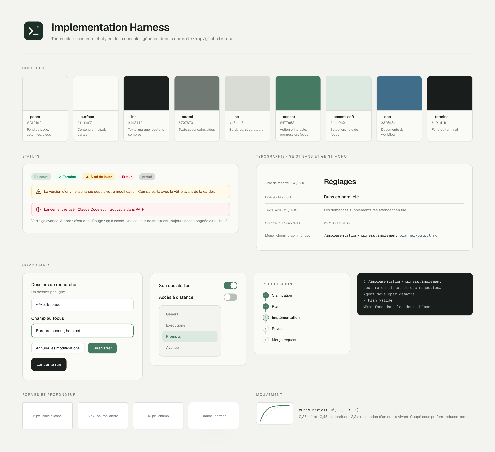
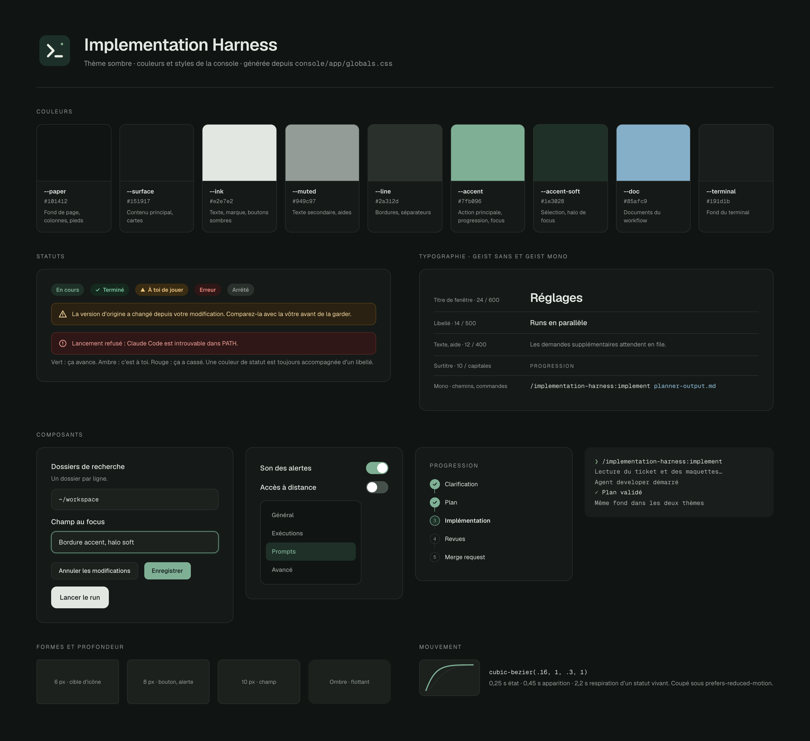

# Brand book Implementation Harness

Ce document décrit l’identité visuelle et le ton de l’application : console web et icône. Il décrit ce qui existe dans le code. Quand un écran s’en écarte, on corrige l’écran ou on met ce document à jour dans le même commit, jamais l’un sans l’autre.

Les deux planches sont générées depuis les tokens de `globals.css` et la palette Tailwind : après un changement de style, relancer `node scripts/render-brand-sheet.mjs` depuis `console/` (source : `brand/sheet.html`).

Les sources de vérité restent dans le code :

- tokens de couleur et classes partagées : `console/app/globals.css`
- polices : `console/app/layout.tsx`
- icône : `brand/icon.svg`

## Intention

L’interface reste calme. L’application surveille des sessions longues qui prennent des décisions dans le code de quelqu’un : elle doit inspirer confiance, se lire vite et n’attirer l’attention que lorsqu’une décision humaine est attendue.

- **Papier et encre.** Fonds légèrement chauds, texte presque noir, une seule couleur d’accent.
- **Le vert veut dire que ça avance**, l’ambre veut dire que c’est à toi, le rouge veut dire que ça a cassé. Aucune autre couleur ne porte de sens.
- **Dense mais aéré.** Beaucoup d’information dans de petites tailles, compensée par des marges généreuses et des séparateurs fins.
- **Rien de décoratif.** Pas de dégradé, pas d’illustration, pas d’emoji dans l’interface.
- **Deux thèmes, une seule identité.** La console suit la préférence du système (`prefers-color-scheme`) tant qu’on n’a pas cliqué sur le bouton de thème ; ensuite elle garde ce choix (`impl.theme` dans le stockage local). Le thème est posé en attribut `data-theme` sur `<html>` avant le premier affichage, pour ne jamais faire clignoter le thème clair. Le thème sombre garde la même identité : fonds vert très sombre, encre claire, accent éclairci pour rester lisible. Aucun composant ne choisit sa couleur selon le thème, seuls les tokens changent.

## Icône

Un carré arrondi vert très sombre, un chevron d’invite de commande suivi d’un curseur, et un point vert clair en haut à droite : le terminal, et un signal qui dit que quelque chose tourne.

| Élément | Valeur |
|---|---|
| Fond | `#1c3029`, rayon 194 sur 864 (environ 22 %) |
| Chevron et curseur | `#e9eee5`, trait 64, extrémités et jointures arrondies |
| Point de statut | `#88ad8e` |

Dans l’application, la marque est un carré `size-8` fond `--ink` avec l’icône Phosphor `Code` en `--on-ink`, graisse `bold` : carré sombre en thème clair, clair en thème sombre. On ne recolore pas l’icône, on ne l’entoure pas d’un cadre, on ne l’utilise pas sur fond vert.

## Couleurs

### Tokens

Toujours passer par les variables CSS (`bg-[var(--accent)]`), jamais par une valeur recopiée : pas de `bg-white`, `text-white` ni de code hexadécimal dans un composant, sinon il reste clair en thème sombre.

| Token | Clair | Sombre | Usage |
|---|---|---|---|
| `--paper` | `#f3f4ef` | `#101412` | Fond de page, colonnes latérales, pieds de fenêtre |
| `--surface` | `#fafbf7` | `#151917` | Zone de contenu principale, cartes posées sur `--paper` |
| `--raised` | `#ffffff` | `#1c211e` | Champs de saisie, boutons secondaires, cartes, ligne sélectionnée, fenêtre de document |
| `--sunken` | `#f1f3ee` | `#121614` | Zones en retrait : blocs de code, composeur, rail d’onglets, file d’attente |
| `--backdrop` | `#eceee8` | `#0d100f` | Fond derrière le formulaire de lancement |
| `--tint` | `#f7f8f4` | `#181c1a` | Colonne des agents, survol léger |
| `--ink` | `#1c211f` | `#e2e7e2` | Texte, marque, boutons sombres (clairs en thème sombre) |
| `--ink-hover` | `#2a322e` | `#c5ccc6` | Survol d’un bouton `--ink` |
| `--on-ink` | `#ffffff` | `#111513` | Texte et icône posés sur `--ink` |
| `--tab-selected` | `#1c211f` | `#2a4639` | Pastille de l’onglet actif (vue du run) |
| `--on-tab-selected` | `#ffffff` | `#d6eadd` | Libellé de l’onglet actif |
| `--callout` | `#eef2ec` | `#1f2824` | Carte de question posée dans la conversation, plus claire que le fond en thème sombre pour s’en détacher |
| `--callout-line` | `#d8dcd5` | `#3a4640` | Bordure de cette carte |
| `--muted` | `#707873` | `#949c97` | Texte secondaire, aides, libellés inactifs |
| `--faint` | `#7c847f` | `#737b76` | Mentions de dernier plan (signature, action en cours d’un message) |
| `--line` | `#d8dcd5` | `#2a312d` | Bordures, séparateurs, piste d’une étape non atteinte |
| `--line-strong` | `#b9bfb8` | `#46504a` | Cercle d’une tâche à faire, survol d’une option, interrupteur désactivé |
| `--accent` | `#477a62` | `#7fb096` | Action principale, progression, focus, lien |
| `--on-accent` | `#ffffff` | `#0f1512` | Texte et icône posés sur `--accent` |
| `--accent-soft` | `#dce9e0` | `#1e3028` | Fond d’un élément sélectionné, halo de focus, pastille « en cours » |
| `--accent-strong` | `#2f5546` | `#b3d3c1` | Texte posé sur `--accent-soft` (bandeau de notification) |
| `--doc` | `#3f6d8a` | `#85afc9` | Tout ce qui désigne un document produit par le workflow |
| `--selection` | `#b8d3c3` | `#2e4a3c` | Sélection de texte |
| `--highlight` | blanc à 80 % | blanc à 4 % | Reflet intérieur en haut du formulaire de lancement |
| `--terminal` | `#191d1b` | `#191d1b` | Fond du terminal, identique dans les deux thèmes |

`--raised` est la surface la plus claire en thème clair et la plus haute en thème sombre : c’est elle qui fait détacher un champ ou un bouton secondaire du papier.

### Statuts

Les statuts reprennent la palette Tailwind, toujours en couple fond clair et texte foncé. En thème sombre, `globals.css` inverse les paliers utilisés (`amber-50` devient un fond ambre sombre, `amber-800` un texte ambre clair, de même pour `red` et `emerald`) : les couples restent les mêmes classes et restent lisibles. Un nouveau palier employé dans un composant doit être ajouté à cette inversion.

| Sens | Fond | Texte | Bordure | Exemples |
|---|---|---|---|---|
| Progression, succès | `--accent-soft` ou `emerald-50` | `--accent` ou `emerald-700` | | « En cours », étape terminée, « Terminé » |
| Décision attendue | `amber-50` / `amber-100` | `amber-800` / `amber-900` | `amber-200` | « À toi de jouer » (seulement pour une question ou une saisie attendue dans le terminal), « Sans suite » (le run n’a plus de prochaine action, sans qu’on ait posé de question), avertissement |
| Erreur | `red-50` | `red-700` / `red-800` | `red-200` | Lancement refusé, champ invalide, « Erreur », « Interrompu » (session perdue, distincte d’une erreur du workflow) |
| Neutre, arrêté | `--line` | `--muted` | | « Arrêté » |

Une couleur de statut n’est jamais seule : elle accompagne un libellé et, pour l’attention et l’erreur, une icône (`Warning`, `WarningCircle`).

## Typographie

| Rôle | Police | Taille et graisse |
|---|---|---|
| Titre de page | Geist Sans | `text-2xl`, `font-semibold`, `tracking-tight` |
| Libellé de champ, titre de section | Geist Sans | `text-sm`, `font-medium` |
| Texte courant, aide, bouton | Geist Sans | `text-xs` (12 px), aides en `--muted` avec `leading-relaxed` |
| Métadonnées, compteurs, pastilles | Geist Sans ou Mono | `text-[11px]`, `text-[10px]`, `text-[9px]` |
| Surtitre | Geist Sans | `text-[10px]`, `uppercase`, `tracking-[.16em]`, `--muted` |
| Chemins, commandes, identifiants, prompts, nombres | Geist Mono | `font-mono`, `text-xs` |

La hiérarchie repose sur la graisse et la couleur plus que sur la taille : on reste entre 9 et 15 px dans les panneaux, le `text-2xl` est réservé au titre d’une fenêtre. Tout ce qui se copie dans un terminal (chemin, branche, URL, commande) est en mono.

## Formes, espaces et profondeur

- **Rayons.** `rounded-lg` pour les boutons, alertes et éléments de navigation ; 10 px pour les champs (`.field`) ; 11 px pour les boutons d’action du run ; `rounded-full` pour les pastilles, compteurs et interrupteurs ; `rounded-md` pour les petites cibles d’icône.
- **Bordures.** 1 px `--line`. Une bordure `--accent` signale le focus ou la sélection, jamais la décoration.
- **Espacement.** Grille Tailwind de 4 px. Sections séparées par `border-t` `--line` et `pt-6`, marges de fenêtre `px-7 py-8`.
- **Ombres.** Rares, longues et diffuses, teintées de vert sombre (`rgba(30,42,35,…)`) avec un décalage vertical négatif. Elles servent aux éléments flottants (dialogue, panneau superposé), pas aux cartes.

## Composants

- **Champ.** Classe `.field`. Fond `--raised`, bordure `--line`, 12 × 14 px de marge interne ; au focus, bordure `--accent` et halo `--accent-soft` de 2 px. Désactivé : `opacity-60`.
- **Bouton secondaire.** Fond `--raised`, bordure `--line`, `text-xs font-medium`, `px-3.5 py-2`, survol `--paper`.
- **Bouton principal.** Fond et bordure `--accent`, texte `--on-accent`. Un seul par zone d’action, toujours à droite.
- **Bouton d’action du run.** Fond `--ink`, texte `--on-ink`, rayon 11 px. Réservé aux gestes qui font avancer un run : le lancer, répondre à une question, envoyer une instruction.
- **Boutons d’en-tête.** En haut à droite, carrés `size-7`, `rounded-lg`, bordure `--line`, icône de 14 px. Le thème (icône du thème vers lequel il bascule : `Moon` en clair, `Sun` en sombre, `--muted`) puis le son (`--accent` activé, `--muted` coupé). Chacun est un `role="switch"` avec un libellé accessible et une infobulle qui dit l’état et l’effet du clic.
- **Interrupteur.** Piste 44 × 24 px, `--accent` activé, `--line-strong` désactivé, pastille blanche.
- **Alerte.** `rounded-lg`, bordure et fond de la couleur de statut, icône à gauche, action de reprise soulignée sous le texte.
- **Pastille de statut.** `rounded-full`, `px-2 py-1`, `text-[10px] font-semibold`, couple fond et texte du statut.
- **Navigation latérale.** Élément actif en fond `--accent-soft` et texte `--accent`, inactif en `--muted` avec survol `--raised` à 60 %.
- **Agent.** Photo ronde (`public/avatars/`, `object-cover`) liée à son prénom, suivie de « Prénom · Rôle », le prénom en `--ink`, le séparateur et le rôle en `--muted`. Sans photo, l’initiale sur fond `--accent-soft`. Ce sont les seules images de personnes de l’interface : elles distinguent les agents d’un même run, elles ne décorent pas.
- **Carte de tâche (Suivi).** Fond `--raised`, bordure `--line`, `rounded-lg`, posée sur une colonne `--paper`. Cercle vide à faire, anneau ambre en cours, coche `--on-accent` sur `--accent` terminée ; complexité et identifiant en mono `--muted`.
- **Détail de tâche (Suivi).** Un clic sur une carte ouvre une fenêtre de 560 px au plus, fond `--surface` sur le voile des dialogues. En tête, la marque de statut, le titre, puis identifiant, statut, complexité et agent en `text-[10px]`. Le corps reste court : le résumé de la tâche (le `summary` du plan, ou à défaut la première phrase de sa description), puis, replié sous « Détail pour le développeur » sur fond `--paper`, la description complète en paragraphes courts, les fichiers en mono, les critères couverts et les dépendances en pastilles `--paper`. Chemins et identifiants sont en code (`--accent-soft`, mono), même quand le plan les a écrits sans backticks. Les étapes de vérification et le texte des critères restent dans le plan. Échap, le fond ou « Fermer » la referment, et le focus revient sur la carte.
- **Critère d’acceptation (Preuves).** Ligne dépliable, identifiant en mono `--muted`, texte en `--ink`, pastille d’état à droite. Vérifié en `emerald`, échec en `red`, bloqué en `amber` (quelqu’un doit agir), non vérifié en fond `--line` et texte `--ink` plutôt que `--muted`, pour rester lisible : un critère non vérifié n’est jamais vert. Les réserves sur une preuve (« Preuve ancienne », « Version inconnue », « Mesure non concluante ») sont de petites pastilles `amber-50`, les mentions neutres (« Résultat rapporté », « Confirmation », « Tentative de mise en échec ») des pastilles `--paper`. Sous les preuves d’un critère, les tentatives de mise en échec qui n’ont trouvé aucun défaut sont listées à part, après une phrase d’aide en `text-[11px]` `--muted` qui dit qu’elles ne comptent pas comme vérification. Leur pastille est neutre, fond `--paper` et texte `--muted` : « Aucun défaut trouvé », « Lue, non exécutée » ou « Non exécutée ». Une tentative qui passe n’est jamais verte. Seule « Défaut trouvé » prend une couleur, `red`.
- **Verdict QA (Preuves).** Pastille de statut dans la synthèse de l’onglet, après « Verdict QA », le tour et le mandat s’il y en a un, et à côté du titre du rapport dans « Rapports par source ». « Validé » en `emerald`, « Validé avec réserves » en `amber`, « Non concluant » en fond `--line` et texte `--ink`, « Échec » en `red`. Un statut que le contrat ne connaît pas s’affiche tel quel, en mono `text-[10px]` `--muted`. Quand le verdict contredit les preuves, un avertissement suit : `rounded-lg`, bordure `amber-200`, fond `amber-50`, texte `amber-900` en `text-[11px]`, icône `WarningCircle` `fill` à gauche. Les remarques sur l’ordre des plans de revue sont de simples lignes `text-[11px]` `--muted` sous la synthèse, sans fond ni bordure.
- **Bandeau d’incident (vue du run).** Sous les onglets, pleine largeur, fond et bordure basse de la couleur de statut : `amber` pour une attente, un doute ou un incident qu’on peut encore traiter, `red` pour une session interrompue. Icône `fill` à gauche (`Warning`, `WarningCircle`, `HourglassMedium` pour un doute), titre factuel en `font-semibold`, cause en une phrase, « Prochaine action attendue », puis seulement les actions possibles : « Demander la continuation » en bouton d’action du run, les autres en boutons secondaires. Le diagnostic reste replié. Dans la liste des runs, la même information tient dans la troisième ligne de la rangée, icône et libellé de la couleur du statut. Le texte de l’erreur n’est pas répété dans la colonne de droite quand le bandeau le dit déjà. Un run archivé n’a plus de session : sa durée s’arrête à son dernier événement connu, et sa conversation vide ne renvoie pas vers le terminal.
- **Worktree (vue du run).** Sous la progression, deux lignes « Dépôt » et « Worktree » : libellé en `text-[10px] font-semibold` `--muted`, valeur en mono `text-[10px]`. Le worktree actif montre son chemin depuis le dépôt en `--ink` ; une fois la session partie, la ligne dit pourquoi il reste (« Worktree conservé : changements non poussés ») ou « Worktree supprimé », en `--muted`. L’action « Supprimer le worktree » est un bouton d’en-tête du run, icône `FolderDashed`, texte `--muted`, offert seulement quand le worktree est encore sur le disque et sa session fermée. Si du travail n’est ni commité ni poussé, un bandeau `amber` de la forme du bandeau d’incident dit ce qui serait perdu et propose « Supprimer quand même » et « Annuler » ; la branche n’est jamais supprimée, et le texte le dit. Dans la liste, ces runs sans session sont rangés sous « Worktrees conservés », avec l’icône `FolderDashed` et la raison en `--muted`.
- **Rangée de la liste des runs.** À gauche, un point de la couleur du statut, qui respire tant que le run tourne. Un run terminé remplace ce point par une coche `CheckCircle` `fill` en `--accent`, et sa troisième ligne dit « Terminé » en `--accent` à la place de la dernière action : le vert seul désigne aussi un run en cours, c’est la forme qui les distingue.
- **Couverture dans la liste des runs.** Au bout de la troisième ligne, « vérifiés/total AC » en mono `text-[9px] font-semibold`, texte seul de la couleur du pire état restant (`red-700` pour un échec, `amber-800` pour un blocage, `--accent` quand tout est vérifié, `--muted` sinon). Le détail va dans le libellé accessible et l’infobulle. Rien sans registre de critères.
- **Tokens d’un run.** Dans la liste, au bout de la troisième ligne et avant la couverture, le total en mono `text-[9px]` `--muted` (« 3,36 M », « 412 k »), le nombre exact dans l’infobulle. Dans la progression du run, sous la durée : libellé « Tokens » en `text-[10px] font-semibold` `--muted`, total en mono `text-[10px]` `--ink`, puis une ligne `--muted` qui donne la part du pilote, son nombre d’appels et le nombre d’agents. Le chiffre bouge pendant le run, sans animation et sans annonce : il se lit, il n’alerte pas. Les tokens comptent le cache, lu et écrit.
- **Mesures.** Bouton d’en-tête de la liste des runs, icône `ChartBar`, à gauche de « Nouveau run » ; actif, il prend le fond `--accent-soft` et le texte `--accent`. La vue remplace celle du run : un titre de section, une phrase d’aide, puis quatre médianes (surtitre, valeur en mono `text-sm`) qui n’apparaissent qu’à partir de trois runs livrés. Dessous, une table, pas de graphique : une ligne par run, en-têtes en `text-[10px]` `--muted` avec une infobulle qui définit la colonne, nombres en mono `text-[10px]` alignés à droite, cellule vide quand la donnée manque. Le nombre de reprises passe en `amber-800` `font-semibold` dès qu’il n’est pas nul. L’issue est une pastille de statut : `emerald` pour un run livré, `red` pour une erreur, neutre pour un arrêt, `--accent-soft` tant qu’il tourne. Le chevron `CaretRight` ouvre le détail sur fond `--sunken` : tokens par session, temps par attente et par phase, revue.
- **Champ des tickets (lancement).** Zone de texte `.field` qui grandit d’une à huit lignes, une URL par ligne. Dès qu’il y a plusieurs lignes, ou une ligne non reconnue, le décompte s’affiche dessous en `text-[11px]` : « 3 tickets reconnus » en `--accent`, les doublons ignorés en `--muted`, puis une ligne `red-700` par entrée refusée (« Ligne 2 : … n’est pas une URL de ticket GitLab. »), le texte fautif en mono. À partir de deux tickets, le choix du répertoire laisse place à une phrase d’aide `--muted`, le libellé de l’instruction précise qu’elle s’applique à tout le lot, et le bouton d’action du run dit « Lancer les 3 tickets ». Il reste désactivé tant qu’une ligne est refusée.
- **File d’attente (liste des runs).** Sous les runs en cours, avant les archives, sur fond `--sunken`. Un lot a son titre (« Lot de 14:32 · 3 tickets en file », `text-[10px] font-semibold`), puis le nom de chaque dépôt en mono `text-[9px]` `--muted`, puis ses tickets, désignés par leur numéro. Un lancement isolé garde une rangée seule, sans titre. Le point creux de la rangée respire pendant « Analyse en cours ». La deuxième ligne dit ce que le ticket attend, en `--muted` : « En attente, conflit avec #217 en cours », « Attend que la MR !12 soit mergée (#217) », « Dépend de #217, encore en file », « Passe après #217 ». « État de la MR !12 inconnu (#217) » passe en `amber-800` avec l’icône `Warning` `fill`, comme les mentions « Analyse en échec » et « Prédiction peu fiable ». « Pourquoi il attend » est un dépliant fermé par défaut (chevron `CaretRight` qui pivote) : la raison donnée par l’agent en `--ink`, le résumé du ticket en `--muted`, puis les deux départs forcés. Ce sont des boutons secondaires en pleine largeur, « Lancer depuis la base » et « Empiler sur `branche` » (la branche en mono), chacun suivi d’une phrase `text-[10px]` `--muted` qui dit ce que le geste coûte. « Empiler » n’est proposé que si la branche de l’autre ticket existe. Monter, descendre et retirer sont des boutons d’icône `size-5` à droite du numéro, avec un libellé accessible qui nomme le ticket.
- **Terminal.** Fond `--terminal`, barre de défilement fine `#47504b`. En thème clair, c’est la seule surface sombre de l’application ; en thème sombre, il garde le même fond et les mêmes couleurs ANSI.

Tous les éléments interactifs ont un focus visible : `outline-2`, décalage 2 px, couleur `--accent`. Les actions appuyées descendent d’un pixel (`active:translate-y-px`).

## Icônes

Bibliothèque unique : [Phosphor](https://phosphoricons.com), composants `…Icon` de `@phosphor-icons/react`.

- Graisse `regular` par défaut, `bold` pour une coche ou la marque, `fill` pour un indicateur de statut.
- Tailles de 12 à 16 px dans les panneaux, 17 à 18 px dans la navigation. L’icône prend la couleur du texte qui l’accompagne.
- Une icône seule porte toujours un `aria-label`.

## Mouvement

- Courbe unique : `cubic-bezier(.16, 1, .3, 1)`, rapide au départ, douce à l’arrivée.
- Durées : 0,25 s pour un changement d’état (focus, survol), 0,45 s pour l’apparition d’un bloc (`.reveal`, glissement de 8 px), 2,2 s pour la respiration d’un statut vivant (`.status-breathe`).
- Le mouvement signale un changement, il ne décore pas. Tout est coupé sous `prefers-reduced-motion`.

## Ton et rédaction

L’interface est en français, le code et ses commentaires en anglais.

- **Phrases courtes et concrètes.** Dire ce qui se passe et ce que l’on peut faire. « Ce run n’existe plus. » plutôt que « Une erreur est survenue ».
- **Tu ou vous.** Les descriptions et aides vouvoient (« Adaptez les instructions… »), les statuts et messages d’erreur tutoient (« À toi de jouer », « Recharge-les avant d’enregistrer »). C’est l’usage actuel, pas un choix tranché : à harmoniser sur une seule forme.
- **Un message d’erreur dit quoi faire.** « Recharge-les avant d’enregistrer », « Vérifie les droits d’accès au dossier de données ».
- **Typographie française.** Apostrophe typographique `’`, guillemets `« »` avec espaces, points de suspension `…` pour une action qui ouvre une fenêtre (« Réglages… »), pas de tiret cadratin ni demi-cadratin.
- **Vocabulaire.** Un *run* est une exécution du workflow sur un ticket, une *session* est le processus Claude Code qui le porte. *Livré* signifie déployé en production ; une MR fusionnée est *mergée*, jamais livrée.
- Pas d’emoji, pas de point d’exclamation, pas d’écriture inclusive.

## Accessibilité

- Contraste AA visé pour tout texte (4,5:1). Écart connu : `--muted` atteint 4,1:1 sur `--paper` et 4,4:1 sur `--surface`, sous le seuil ; le texte blanc sur `--accent` est à 5:1. En thème sombre, `--muted` dépasse 6:1 sur `--surface` et `--accent` 7:1. Tant que `--muted` n’est pas foncé, ne pas l’utiliser pour une information indispensable.
- Le sens ne passe jamais par la couleur seule (libellé, icône ou forme en plus).
- Les zones qui changent pendant un run (statut d’enregistrement, compteurs) sont annoncées avec `role="status"` et `aria-live="polite"`, les erreurs avec `role="alert"`.
- Chaque champ a un `label` associé et ses aides reliées par `aria-describedby`.
